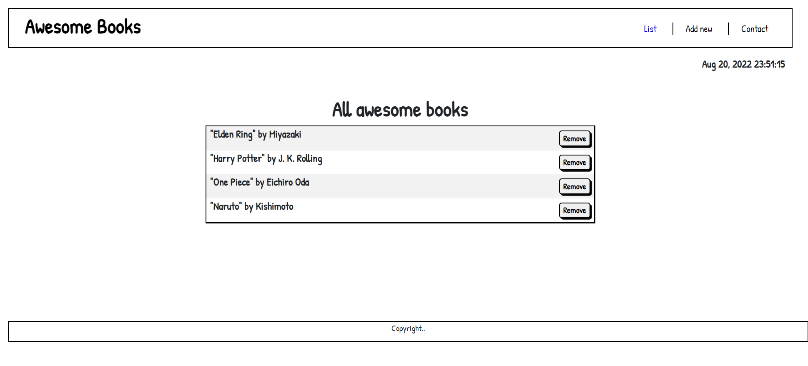

# Awesome books

## Screenshot

## Built With
- HTML
- CSS
- JS
## Live Demo

[Awesome books](https://rex-9.github.io/AwesomeBooks/)

## Getting Started

To get a local copy up and running:

1. Clone this repository or download the zip folder:

**``git clone https://github.com/rex-9/AwesomeBooks.git``**

2. Navigate to the location of the folder in your machine:

**``you@your-Pc-name:~$ cd <folder>``**

To get a local copy up and running follow these simple example steps.

### Deployment

Here is the online version of [Awesome Books](https://rex-9.github.io/AwesomeBooks/)

## Author
👤 - Github: [rex-9](https://github.com/rex-9) 
👤 - Linkedin: [rex9](https://linkedin.com/in/rex9) 
👤 - Angelist: [rex9](https://angel.co/u/rex9) 
👤 - Facebook: [htetnaing0814](https://facebook.com/htetnaing0814)

## 🤝 Contributing
Contributions, issues, and feature requests are welcome!

Feel free to check [issue page](https://github.com/rex-9/AwesomeBooks/issues).

## Show your support
Give a ⭐️ if you like this project!

## Acknowledgments
[Microverse](https://bit.ly/MicroverseTN)

## 📝 License
This project is MIT licensed.